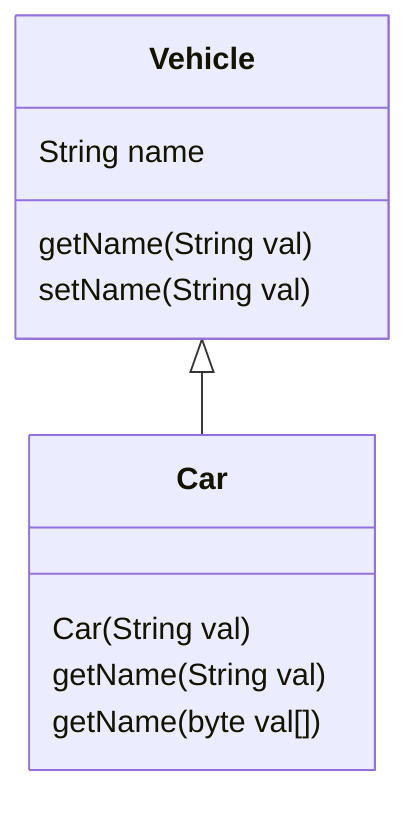

#### 1
> 스태틱 변수 b , 변수 a 정수
```java
class Static{
  public int a = 20;
  static int b = 0;
}
public class Main {
  public static void main(String[] args) {
    int a;
    a = 10;
    Static.b = a;
    Static st = new Static();
    System.out.println(Static.b++); // 10 출력 후 ++
    System.out.println(st.b); // 11
    System.out.println(a); // main의 a 10
    System.out.print(st.a); // new Static이 담긴 st의 a 20
  }
}
```

> sol
- static 키워드는 static(소문자) / 여기서 Static은 Static class
- static int b=0; => main method 시작 전 생성
- answer : `10 11 10 20`

---

#### 2
> C언어 Art- println
```c
#include <stdio.h>
​
int main() {
  char a[] = "Art"; // a[] = A | r | t | NULL == a[0] a[1] a[2] a[3]
  char* p = NULL;
  p = a; // p = a => p[0] ~ p[3]
  printf("%s\n", a); // a+0 == &a[0] == a => Art
  printf("%c\n", *p); // p == a == &p[0] == &a[0] => *p == *&a[0] == a[0] => A
  printf("%c\n", *a); // a = &a[0] => *a = *&a[0] = a[0] => A
  printf("%s\n", p); // p == a == &p[0] == &a[0] => Art
  ​
  for(int i = 0; a[i] != '\0'; i++) // '\0' == NULL
    printf("%c", a[i]);
}
```
> sol
- `배열+i == &배열[i]` &배열[i]는 주소값
- answer
  ```
  Art
  A
  A
  Art
  Art
  ```
---

#### 3
```c
#include <stdio.h>
​
int main() {
  char* a = "qwer"; // a = q | w | e | r | NULL == a[0] a[1] a[2] a[3] a[4]
  char* b = "qwtety"; // b = q | w | e | t | y | NULL == b[0] b[1] b[2] b[3] b[4] b[5]
  for(int i = 0; a[i] != '\0' ; i++){
    for(int j = 0; b[j] != '\0'; j++){
      if(a[i] == b[j]) printf("%c", a[i]);
    }
  }
}
```
> sol
- answer
  ```
  qwe
  ```
---

#### 4
> **은 웹에서 JS, XML을 이용하여 비동기식으로 웹 페이지의 일부 컨텐츠만 리로드해오는 방식.
> 클라이언트 사이드에서는 JS만처리하고, 서버 사이드에서는 **만 처리하기 대문에 빠르게 처리 가능한 방식이다.
> Google Maps와 Google **에서 이러한 방식을 사용한다.

> sol
- AJAX(asynchronus Javascript and XML)
- 비동기식
- 필요한 일부 컨텐츠만 리로드
---

#### 5
> 데이터교환방식 패킷교환문제
1. 패킷 교환 방식에서 패킷이 전송되기 전에 송/수신 스테이션 간의 논리적인 통신 <u>경로를 미리 설정</u> 하는 방식
2. <u>연결 경로를 확립하지 않고</u> 각각의 패킷을 순서에 무관하게 독립적으로 전송하는 방식

> sol
- 미리 설정? 가상회선 방식(VC; Virual Circuit)
- 설정하지 않음? 데이터그램(Datagram)

- 서킷 교환
  - 전용 선(전화 a-b쓰면 c는 못써)
- 패킷 교환
  - 가상회선
    - A-패킷->B, 처음 전송된 경로 따라감
  - 데이터그램
    - A-패킷->B, 패킷마다 최적의 경로 찾음
---

#### 6
> VPN 문제, 데이터 링크 계층 프로토콜 / L2F, PPTP의 결합 형태
- VPN에서 사용되는 프로토콜 중 하나로, L2F(Layer 2 Forwarding Protocol)와 PPTP(Point-to-Point Tunneling Protocol)의 기능을 결합
- 인터넷 상에서 두 지점 간에 <u>가상의 터널</u>을 만들어 통신을 안전하게 전송하는 기술

> sol
- <u>L2</u>F + PP<u>TP</u> => L2TP
  - L2F : cisco(제조사), UDP
  - PPTP : MS(제조사), 단대단 통신(1:1)
  - PC (L2TP Client)--- INTERNET --->(L2TP Server) SERVER
  - VPN 프로토콜 종류 : L2TP, L2F, PPTP
- answer : L2TP
---

#### 7
> Port번호 22인 프로토콜
- 포트번호 22번 사용하고 인증, 암호화, 압축, 무결성 제공
- Telnet 보다 강력한 보안을 제공하는 원격접속 프로토콜

> sol
- 포트번호 22번, Telnet 보다 강력한 보안
- answer : SSH(Secure Shell)
- FTP 21 / SSH 22 / Telnet 23 / SMTP(mail) 25 / HTTP 80
---

#### 8
> 웜, 트로이목마, 바이러스
- **웜**
  - 인터넷 또는 네트워크를 통해서 컴퓨터에서 컴퓨터로 <u>스스로 전파</u>되는 악성 프로그램이다.
  - 윈도우의 취약점 또는 응용 프로그램의 취약점을 이용하거나 이메일이나 공유 폴더를 통해 전파되며, 최근에는 공유 프로그램(P2P)을 이용하여 전파되기도 한다.
  - 가장 큰 특징은 <u>자신을 복제</u>하여 네트워크 연결을 통해서 다른 컴퓨터로 스스로 전파되고 확산된다는 것이다.
​
- **트로이 목마**
  - <u>악성 루틴이 숨어 있는</u> 프로그램으로 <u>겉보기엔 정상적인 프로그램으로 보이지만, 실행하면 악성 코드를 실행</u>하는 프로그램이다
  - 자기 복제를 하지 않으며 다른 파일을 감염시키거나 변경시키지 않지만, 해당 프로그램이 포함된 프로그램이 실행되는 순간, 시스템은 공격자에게 시스템을 통제할 수 있는 권한을 부여하게 된다.
​
- **바이러스**
  - 사용자 컴퓨터(네트워크로 공유된 컴퓨터 포함) 내에서 사용자 몰래 프로그램이나 실행 가능한 부분을 <u>변형해 자신 또는 자신의 변형을 복사</u>하는 프로그램이다.
  - 가장 큰 특성은 복제와 감염이다. 다른 네트워크의 컴퓨터로 <u>스스로 전파되지는 않는다.</u>
---

#### 9
> int 형태로 표현된 이진수 101110를 int 형태의 십진수로 변환하는 코드에 관한 문제. 문제가 출제된 영역은 이진수를 2또는 10으로 나눈 나머지만 취하여 변수 sum에 합하는 방식으로 구현되어 있었음.

```c
int main() {
  int input = 101110;
  int di = 1;
  int sum = 0;
​
  while (1) { // 0이 아니면 무조건 참
    if (input == 0) break // 0이면 반복문 탈출
    else {
      sum = sum + (input ⓐ ⓑ) * di; // 맨 뒷자리 사용하도록
      di = di * 2; // 2의 n제곱
      input = input / 10; // 맨 뒷자리 제거
    }
    ​printf("%d", sum);
    return 0;
  }
}
```
> sol
- 101110 => (1 * 2<sup>5</sup>) + (0 * 2<sup>4</sup>) + (1 * 2<sup>3</sup>) + (1 * 2<sup>2</sup>) + (1 * 2<sup>1</sup>) + (0 * 2<sup>0</sup>) => `di = di * 2`
- `input = input / 10` => 맨 뒷자리 사라짐
- `(input ⓐ ⓑ) * di` => 맨 뒷자리를 사용하는 시점 => `int input = 101110` 이진수이지만 10진수로 저장됨 => `(input % 10) * id`
- answer : % 10
---

#### 10
> IP 동작 과정에서 전송 오류가 발생하는 경우, 오류 정보를 전송하는 목적으로 사용하는 프로토콜로, <u>Ping-of-Death(PoD)</u>에서 사용하는 것

> sol
- ping? 실제 서버나 PC가 살아있는지 확인할 대 쓰는 명령어
- A - ping -> B - pong -> A
- ping에서 쓰는 프로토콜이 ICMP
- Ping-of-Death? ICMP 패킷을 엄청 크게 보내는 공격
- answer : ICMP
---

#### 11
> 객체의 대리자를 이용하여 원래 객체의 작업을 대신 처리하는 디자인 패턴
- <보기>
  - 생성(Builder:조립, Prototype:원형 복사 Singleton:객체 하나 생성, Abstract Factory:구체적인 클래스 의존X)
  - 구조(Bridge:기능-구현 연결, Decorater:기능 추가, Facade:단순한 iterface,  Flyweight:클래스 경량화, Proxy:대리객체, Composite:부분-전체 구조, Adapter:중간 역할(서로 맞춰줌 220v-110v 연결)..)
  - 행위(Observer:상태변경->다른객체연락, Miderator:중재자(복잡한, 사건 경찰중재느낌), Visitor:클래스 돌아다님, Strategy:캡슐화된 클래스 필요시 교환.. ) 일부가 주어지고 밑에 설명 3~4개 있었음
​
> sol
- answer : Proxy

---

#### 12
> DB관련 내용
- 튜플 : 테이블 내의 행, 레코드, 중복 허용
- (릴레이션) 인스턴스 : 실제로 저장된 데이터의 집합
- (릴레이션) 스키마 : 속성의 집합
- 카디널리티 : 특정 데이터 집합의 유니크한 값의 개수, 튜플 개수
---

#### 13
> [학생] 릴레이션에서 학생 이름(컬럼 명)이'민수'인 튜플을 삭제하는 쿼리를 작성하여라 (sql delete 문제)
```sql
DELETE FROM 학생 WHERE 이름='민수';
```
---

#### 14
> 버블정렬문제(변수명로 작성)
```java
class Soogebi{
  static void swap(int[] a, int idx1, int idx2){
    int t = idx1;
    a[idx1] = a[idx2];
    a[1번] = t; // 1번 == idx2
  }
  static void Usort(int[] a, int len){ // Usort(item, 2번) int[] a == item, 2번 == int형 변수 == nx
    // 버블정렬 코드
    for(int i=0;i<len;i++){
      for(int j=0;j<len-i-1;j++){
        if(a[j]>a[j+1]){
          swap(a, j, j+1);
        }
      }
    }
  }
}
​
public static void main(String[] args){
  int []item = {5,4,9,1,3,7}; // item[0] == 5, ..., item[5] == 7, 정수이기때문에 item[6] == NULL 없음, string일 경우에만 마지막에 NULL 붙음
  int nx = 6;
  Usort(item, 2번); // 2번 == nx
  for(int data : item){
    System,out.print(data+"");
  }
}
```

> sol
```java
static void swap(a, b, c){
  c = a;
  a = b;
  b = c;
}
// swap 패턴 : '//\' 모양으로 같은 값이어야 함
// a[0] <-> a[1], a[1] <-> a[2], ...
```
- answer : 1번: idx2/ 2번: nx
---

#### 15
```python
a = {'한국', '중국', '일본'}
a.add('베트남') # a = {'한국', '중국', '일본', '베트남'}
a.add('중국') # a = {'한국', '중국', '일본', '베트남', '중국'} => a = {'한국', '중국', '일본', '베트남'}
a.remove('일본') # a = {'한국', '중국', '베트남'}
a.update({'홍콩', '한국', '태국'}) # a = {'한국', '중국', '베트남', '홍콩', '한국', '태국'} => a = {'한국', '중국', '베트남', '홍콩', '태국'}

print(a)
```

> sol
- python 은 자료형에 주목
  - { } : 세트형, 중복허용X, print할 때 {}에 감싸서 써줘야함
- answer : {'한국', '중국', '베트남', '홍콩', '태국'}
---

#### 16
> sql문제
> ISO/ISE 9075 : 데이터베이스 표준
(조건: where사용하지 말 것. 세미콜론 생락가능, group by와 having사용. 집계함수 사용)

> sol
```sql
-- 셀프(웨) 구해오 / GROUP BY 컬럼명은 SELECT 컬럼명과 동일하게 적기
SELECT 과목, MIN(점수) AS 최소점수, MAX(점수) AS 최대점수
FROM 성적
GROUP BY 과목
HAVING AVG(과목) >= 90;
```
---

#### 17
> Java car, vehicle 상속
```java
abstact class Vehicle {
  String name;
  abstract public String getName(String val);
  ​
  public String getName() {
    return "Vehicle name: " + name; // Vehicle name: Spark
  }
  public void setName(String val) {
    name = val; // name = 'Spark'
  }
}
​
class Car extends Vehicle {
  public Car(String val) {
    setName(val); // setName이 Car 내부에 없으니까 부모인 Vehicle 내부에서 찾기
  }
  public String getName(String val) {
    return "Car name:" + val;
  }
  public String getName(byte val[]) {
    return "Car name:" + val;
  }
}
​
public class Test {
  public static void main(String[] args) {
    Vehicle obj = new Car("Spark"); // obj에 Car가 생성됨 => 부모 Vehicle 생성자 호출 -> 자식 Car 생성자 호출
    System.out.println(obj.getName()); // 파라미터 없으니까 부모 Vehicle의 getName()을 호출, 만약에 string이 있었으면 Car 내부에 있는 String getName(String val) 호출
  }
}
```

> sol

- answer : Vehicle name: Spark
---

#### 18
> 스키마
- 외부 : 사용자, 개발자 관점, 논리적 구조, 사용자 뷰
- 개념 : DB 전체적인 논리적 구조, 전체적인 뷰
- 내부 : 물리적 저장 장치, DB에 저장될 레코드 형식 정의
  ```mermaid
  flowchart LR
    A[USER]
    A'[USER]
    A''[USER]
    B{외부스키마}
    B'{외부스키마}
    B''{외부스키마}
    C{개념스키마}
    D{내부스키마}
    F[(디스크)]
    A-->B
    A'-->B'
    A''-->B''
    B-->C
    B'-->C
    B''-->C
    C-->D
    D-->F
  ```
---

#### 19
> 화이트박스문제 (분기 커버리지)
- 분기 커버리지 == 결정 커버리지
  - 결정 포인트에서 조건식이 한 번씩은 T/F, 🔶모양

> sol
- answer : T,T: 1234561 / F,F: 124567 or T,F: 1234567 / F,T: 124561
---

#### 20
```java
class Parent {
  int x = 100;
  ​
  Parent() {
    this(500); // this는 자기 자신 생성자 호출하는데 파라미터 받는 생성자 호출
  }
  Parent(int x) { // this(500)에 의해서 호출
    this.x = x; // this.x = 500
  }
  int getX() {
    return x; // 어떤 클래스의 내부에 있느냐에 따라 x 결정, Parent 내부에 있기 때문에 x == 500
  }
}
class Child extends Parent {
  int x = 4000;

  Child() {
    this(5000); // this는 자기 자신 생성자 호출하는데 파라미터 받는 생성자 호출
  }
  Child(int x) { // this(5000)에 의해서 호출
    this.x = x; // this.x = 5000
  }
}
​
public class Main {
  public static void main(String[] args) {
    Child obj = new Child(); // new 생성자 호출 => 부모 Parent의 Parent() 호출 -> 자식 Child의 Child() 호출
    System.out.println(obj.getX()); // Child에 getX()가 없으니까 부모 Parent의 getX()호출
  }
}
```
> sol
- answer : 500
---
