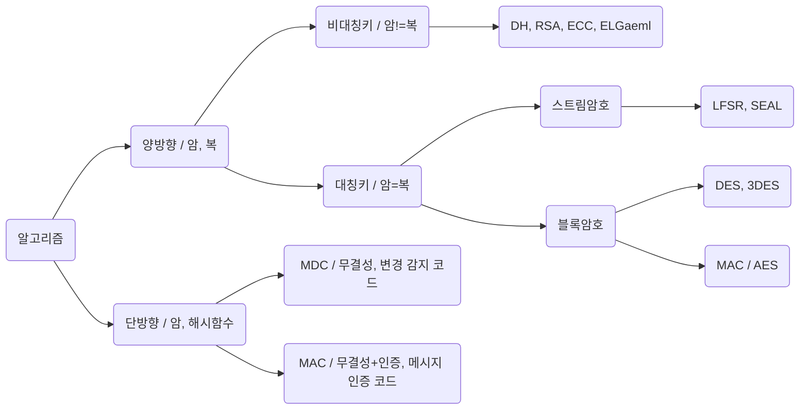

#### 트랜잭션 특징
- 트랜잭션: 논리적 작업 단위
- *ACID (원일격영)*
- 원자성 Atomicity
  - 트랜잭션 성공 or 실패, 기면기고 아니면 아님, All or Nothing
  - Commit / Rollback 회복성 보장
- 일관성 Consistency
  - 트랜잭션 수행 전과 후가 같음, 계속 빈 값이거나 계속 데이터가 있거나
  - 무결성 제약 조건, 동시성 제어
- 격리성=고립성 Isolation
  - 트랜잭션이 다른 트랜잭션으로부터 독립, 작업 중 간섭 받지 않음
  - Read Uncommitted, Read Commited, Repeatable Read, Serializable
- 영속성 Durability
  - 트랜잭션 수행하면 기록에 남겨야함.
  - 회복 기법

#### 트랜잭션 상태변화
- 활성 -> 부분완료 -- commit --> 완료
- 활성 -> 실패 -- rollback --> 철회

#### 트랜잭션 제어 TCL
- COMMIT : 메모리에 영구적 저장
- ROLLBACK : 저장 무효화
- CHECKPOINT : ROLLBACK 시점 지정

#### 병행 제어 미보장 시 문제점
- 갱신 손실, 현황 파악오류, 모순성, 연쇄복귀
  - 갱신 손실 Lost Update : 덮어쓰기 오류
  - 현황 파악오류 Dirty Read : 수행 중간에 다른 트랜잭션이 참조하여 발생하는 오류
  - 모순성 Incosistency : 동시 수행, DB 일관성 결여
  - 연쇄복귀 Cascading Rollback : 복수 트랜잭션 중 취소할 경우 부분 취소 안됨

#### 병행 제어 기법 종류
- 로킹Locking : 일관성, 무결성 유지, 순차적 진행, 직렬화
  - 로킹 단위 작아짐 => DB 공유도 증가, 로킹 오버헤드 증가
- 낙관적 검증 : 검증 수행 안함, 종료 시 검증
- 타임 스탬프 순서 : 실행 전 타임스탬프, 부여된 시간에 따라 작업 수행
- 다중버전 동시성 제어MVCC : 트랜잭션-DB 타임스탬프 직렬

#### DML
- 세인업데
- SELECT, INSERT, UPDATE, DELETE
```sql
-- 기본 형태
SELECT A
FROM T
WHERE C
GROUP BY A
HAVING GC
ORDER BY A ASC(DESC)
```

```sql
SELECT COUNT(DISTINCT A)

WHERE A BETWEEN 1 AND 5
WHERE A IN (1,2,3)
WHERE A LIKE '&문자열일치' '[1개일치]' '[^]1개불일치' '_특정위치1개'
WHERE A IS NULL

GROUP BY A HAVING A >= 1

ORDER BY A
```

```sql
-- JOIN
FROM T1 JOIN T2 ON A = A
FROM T1 LEFT JOIN T2 ON A = A
FROM T1 RIGHT JOIN T2 ON A = A
FROM T1 FULL JOIN T2 ON A = A
FROM T1 CROSS JOIN T2
FROM T LEFT JOIN T ON A1 = A2
```

#### DDL
- 크알드트
- CREATE, ALTER, DROP, TRUNCATE

#### 응집도
- 우논시절 통 순기
- 내유시순 입출출단
- 우연적, 논리적, 시간적, 절차적, 통신적, 순차적, 기능적
- 응집도 낮음(나쁨) -------> 높음(좋음)

#### 결합도
- 내공 외제 스자
- 내전 외제 배파
- 내용, 공통, 외부, 제어, 스탬프, 자료
- 결합도 낮음(좋음) -------> 높음(나쁨)

#### SW 개발 보안 구성요소
- 기무가
- 기밀성, 무결성, 가용성
  - 기밀성 : 정보 공개 및 노출
  - 무결성 : DB변경 정확성, 완전성
  - 가용성 : 지속 사용

#### DoS(Denial of Service)
- 시스템의 자원을 부족하게 해서 원래 용도로 사용 못하게 하는 공격
- 공격자 1대 computer
- DDos와 차의점
  - DDos : 공격자 여러 대 computer, 타겟 집중 공격

#### Dos 공격 종류
- SYN 플러딩 : TCP 프로토콜 구조적 문제 공격
- UDP 플러딩 : 대량 UDP -> ICMP 생성 -> 자원 고갈
- 스머프/스머핑 : 출발지 주소 변조, ICMP Echo 직접 브로드캐스팅하여 마비
- 죽음의 핑 : ICMP 아주 크게
- 랜드어택 : 출발 IP == 목적지 IP, 루프
- 티어 드롭 : IP 패킷 조합 시 Fragment Offset 정보 문제
- 봉크 : 같은 시퀀스 번호 계속 보냄
- 보잉크 : 일정한 간격으로 시퀀스 번호에 빈 공간 생성

#### 세션 하이재킹
- Session Higacking : TCP의 세션 관리 취약점 공격
- 비동기화 상태로 패킷 유실 -> 재전송 패킷 증가
- 탐지 방법
  - 비동기화 상태 탐지
  - ACK 패킷 비율 모니터링
  - 특정 세션 패킷 유실, 재전송 증가 탐지
  - 기대하지 않은 접속의 리셋 탐지

#### 네트워크 공격
  - IP Spoofing : 인증된 호스트의 IP주소 위조
  - ARP Spoofing : 자신의 MAC 주소를 다른 컴퓨터의 MAC인 것 처럼 속임
  - ICMP Redirect 공격 : 특정 목적지로 가는 패킷을 공격자가 스니핑
  - 트로이목마 : 악성 루틴 숨겨 실행하면 악성 코드 실행
  - sniffing : 직접 공격X, 몰래 정보만 보는 수동적 공격

#### 보안 관련(공격)
  - 공급망 공격 : 자동적으로 감염
  - 제로데이 공격 : 발견 전 공격
  - 웜 : 복제
  - 악성 봇 : 해커가 시킴
  - 사이버 킬체인 : 록히드 마틴, APT 공격 방어 분석 모델

#### 서버 접근 통제 유형(임강역)
  - 임의적 접근통제(DAC) : 신분기반
  - 강제적 접근통제(MAC) : 접근 허가 권한 근거
  - 역할기반 접근통제(RBAC) : 역할 기반

#### 3A
- Authentication 인증
- Authorization 권한 부여
- Auccunting 계정 관리

#### 암호 알고리즘


- 대칭 키 암호화
  - DES, 3DES, SEED, AES(기밀성), ARIA, IDEA, LFSR
- 비대칭 키 암호화
  - Diffie-Helllman, RSA(상호인증), ECC, ELGamel
- 해시(메세지 무결성)
  - MD5, SHA-1, SHA-256/384/512, HAS-160, HAVAL

#### 암호화 전송
- SSL/TLS : 전송계층과 응용계층 사이에서 클라이언트와 서버 간의 웹 데이터 암호화(기밀성), 상호 인증 및 정송 시 데이터 무결성을 보장하는 보안 프로토콜
- IPSec : IP계층 무결성, 인증 헤더(AH), 기밀성
- S-HTTP : 웹상 모든 메세지 각각 암호화
- IDEA : 블록암호화 알고리즘, 128bit -> 64bit
- Skipjack : 미 국가안보국, 칩에 내장, 음성 암호화

#### 시큐어 코딩 가이드
- 입보시 에코캡아
- 입력 데이터 검증 및 표현 취약점
  - XSS : 사용자가 공격 사이트 열럼 -> 공격 스크립트 실행
  - CSRF : 사이트간 요청 위조, 사용자 의지 무관
  - SQL Injection: 공격 sql문 삽입, 실행

#### 화이트박스 테스트(구조)
- 구조, 코드, 로직, 클래스 기반
- 구결조 조변다 기제데
- 구문(문장), 결정(선택, 분기), 조건, 조건/결정, 변경, 다중, 기본(경로), 제어, 데이터
  - 구문 : 모든 명령문 적어도 1번 수행
  - **결정 : TF(구문 포함)**
  - **조건 : TF, FT(구문 포함)**
  - 조건/결정 : TT, FF
  - 변경 : TT, FF, TF, FT(A&B => FF제외, A|B => TT 제외)
  - 다중 : TT, TF, FT, FF

#### 블랙박스 테스트(명세)
- 명세, 요구사항, 기능, 경험 기반
- 동경결상 유분페원비
- 동등분할(동치, 균등), 경곗값, 결정, 상태 전이, 유스케이스, 분류 트리, 페어와이즈, 원인-결과, 비교
  - 동등분할 : 유효/무효 그룹핑
  - 경곗값 : 경곗값(0~13 / -1,0,13,14)

#### 성능 테스트 상세
- 부하 : 임계점 찾기
- 강도Stress : 임계점 이상 부하
- 스파이크 : 짧은 시간
- 내구성Endurance : 오랜 시간, 높은 부하

#### 리뷰
- 동료 검토Peer Review : 2-3명 명세서, 설명 들으면서 결함 발견
- 인스펙션Inspection : 형식적, 전문가, 팀
- 워크스루Walk throughts : 짧은 시간

#### 테스트 오라클
- 참 : 발생된 오류 모두 검출
- 샘플링 : 특정 몇 개
- 휴리스틱(추정) : 특정 입력값 올바른 결과 제공, 나머지 추정 처리
- 일관성 : 수행 전 후 결괏값 동일 확인
